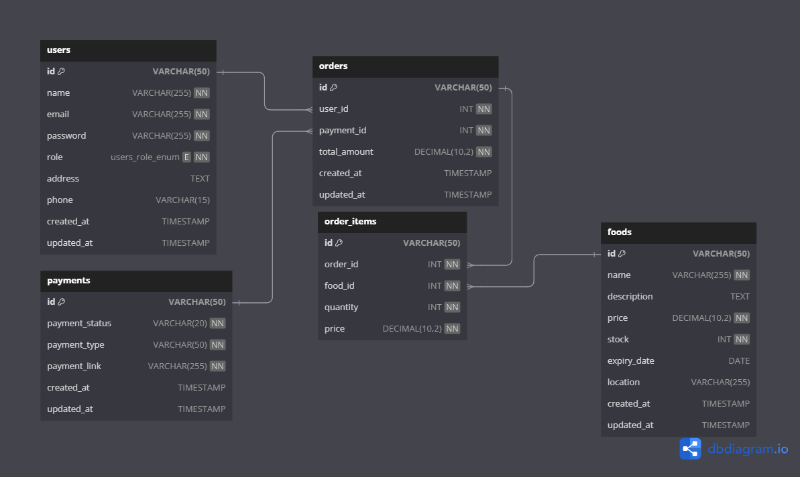

# EcoBite Backend

Aplikasi ini dirancang untuk membantu penjual menawarkan makanan sisa berkualitas dengan harga terjangkau, menghubungkan penjual dan pembeli secara efisien. Aplikasi ini dibangun menggunakan **Golang** dengan arsitektur RESTful API.

---

## 1. Entity Relationship Diagram (ERD)

Berikut adalah ERD untuk aplikasi EcoBite:


## 2. High-Level Architecture (HLA)


Komponen utama dari arsitektur aplikasi ini meliputi:

- **Backend API**: Server RESTful yang ditulis dalam Golang untuk menangani proses bisnis dan pengelolaan data.
- **Database**: Penyimpanan data terstruktur (MySQL atau PostgreSQL).
- **External Services** seperti API Pembayaran dan AI untuk Description produk.

---

## 3. Cara Instalasi dan Penggunaan

### Prasyarat

- Golang
- Database (MySQL atau PostgreSQL)
- Alat pendukung seperti Postman untuk pengujian API

### Langkah Instalasi

1. Clone repositori:

```
git clone https://github.com/MHafidafandi/mini_project_hafid.git
cd mini_project_hafid
```

2. Install Depedencies

```
go mod tidy
```

3. Contoh env

```
DATABASE_USER="root"
DATABASE_PASSWORD="password"
DATABASE_HOST="localhost"
DATABASE_PORT="3306"
DATABASE_NAME="food_sale"
JWT_SECRET_KEY="your_jwt_secret"
```

4. Run app

```
go run main.go
```

## Documentation Api

### Endpoint Api dapat dilihat disini

```
https://greenenvironment.my.id/swagger/index.html
```
